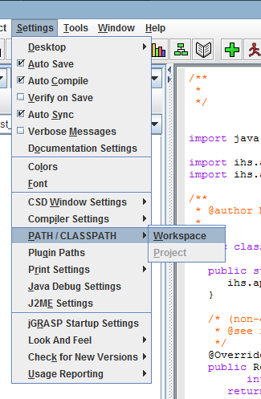
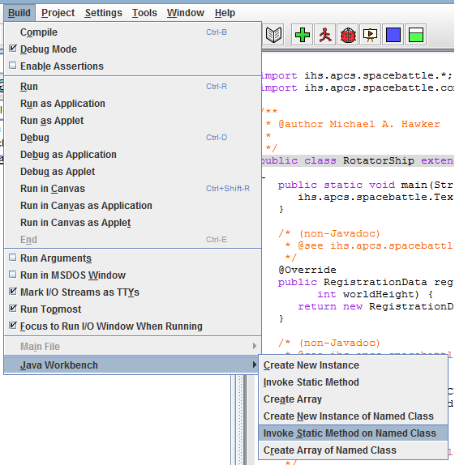
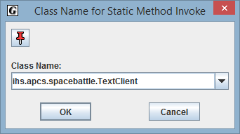
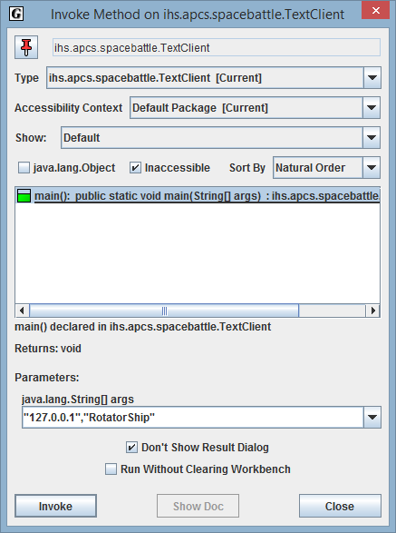

jGRASP Client Environment Setup
=====================

Overview
-----------

This document provides instructions for setting up the Java environment for developing code which controls a ship in the [Space Battle Arena](http://battlearena.mikeware.com/) (SBA) programming game.

These instructions were prepared for [jGRASP](http://www.jgrasp.org/) 1.8 and above.

Initial Environment Setup
-----------------------------

1. Create a Spaceship class:

	```Java
	
import java.awt.Color;

import ihs.apcs.spacebattle.*;
import ihs.apcs.spacebattle.commands.*;

public class ExampleShip extends BasicSpaceship {
    @Override
    public RegistrationData registerShip(int numImages, int worldWidth, int worldHeight)
    {
        return new RegistrationData("Example Ship", new Color(255, 255, 255), 0);
    }
    
    @Override
    public ShipCommand getNextCommand(BasicEnvironment env)
    {
    	return new IdleCommand(0);
    }
    
    @Override
    public void shipDestroyed()
    {
    }
}
	```

2. Adjust Workspace Classpath under Settings -> PATH/CLASSPATH -> Workspace:

	
	
3. Add Gson and SpaceBattle jars under the PATH -> CLASSPATHS tab:

	
	
4. Save and Compile your class.

Execution Instructions
-------------------------

**Note: Do not terminate the program through the jGRASP UI; instead, click in the console window and type 'QUIT' to gracefully close the connection.**

1. Invoke a Static Method on a Named Class from the Build -> Java Workbench menu:

	
	
2. Type in a Class Name of 'ihs.apcs.spacebattle.TextClient' (in subsequent times, it should be selectable from the drop-down list):

	
	
3. Select the main method in the list.

4. Type in the Parameters box the Server IP address and your *Java Class* name in quotes with a comma in-between (also selectable from the drop-down list in subsequent runs):

	
	
	e.g. "127.0.0.1","ExampleShip"

5. Check the 'Don't Show Result Dialog'.

6. Hit the 'Invoke' button and then the 'Close' button.  

7. Type 'QUIT' in the output window to disconnect your ship:

	